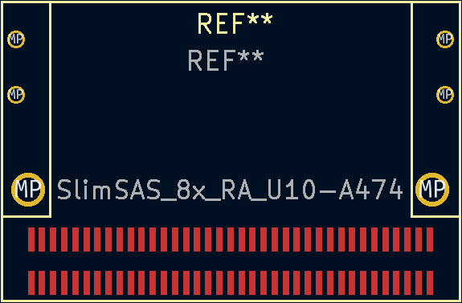

# KiCad_Libraries

KiCad Symbols and Footprints

Some of these symbols and footprints have **NOT** yet been tested on working projects.

## KiCad Symbols

### QSFP SFF-8654

[QSFP](https://en.wikipedia.org/wiki/Small_Form-factor_Pluggable#QSFP)

[Specification](https://members.snia.org/document/dl/25896)

TX are inputs as the data will be sent over the Optical/Copper Interface Cable. RX are outputs as they are received from the Optical/Copper Interface Cable.

### Alveo U25 Debug Connector

Pinout was [manually traced](https://github.com/mwrnd/alveo_u25_notes/blob/main/debug_log.md#figuring-out-the-jtag-debug-connector).

Successfully used by the [Alveo U25 JTAG Adapter project](https://github.com/mwrnd/AlveoU25_JTAG_Adapter).

### OpenCAPI Carrier and Host

Uses the pinout from the [ADM-PCIE-9V5 User Manual (Pg15-19of38)](https://www.alpha-data.com/xml/user_manuals/adm-pcie-9v5%20user%20manual_v1_4.pdf).

Note that a [SlimSAS 8x](https://multimedia.3m.com/mws/media/1398233O/3m-slimline-twin-ax-assembly-sff-8654-x8-30awg-78-5100-2665-8.pdf) cable flips rows. Row A becomes B and vice versa. Use the symbol that is opposite to the one you will connect to. If you intend to connect your design to a board with the Carrier (Add-In Card) pinout, use the Host symbol in your design. TX and RX are relative to the symbol. The RX pin on the Host will have a TX signal on it from the Carrier. TX on the Host gets flipped by cable into RX for Carrier.

The Host Symbol is successfully used by the [OpenCAPI_Breakout](https://github.com/mwrnd/OpenCAPI_Breakout) project.

When used with Innova-2 Flex MNV303212A Rev.A2 boards, differential pairs Tx0, Tx3, and Tx4 have their terminals swapped.

### 74AVC4T774PW

[74AVC4T774](https://www.nexperia.com/products/analog-logic-ics/voltage-translators-level-shifters/74AVC4T774PW.html) 4-bit dual supply level shifting bus transceiver with tri-state outputs in [TSSOP-16 package](https://www.ti.com/lit/pdf/mpds361a).

### SY75572L

[SY75572L](https://www.microchip.com/en-us/product/sy75572l) is a Differential Clock MUX and Fanout Buffer with 2 inputs and 2 outputs used for PCIe Clock selection and distribution.

## KiCad Footprints

### QSFP SFF-8654

**Current Version is not compatible with the QSFP Cage Mounting Holes**

[QSFP](https://en.wikipedia.org/wiki/Small_Form-factor_Pluggable#QSFP) connector with Cage

Based on [U90-A111-1001](https://www.digikey.com/en/products/detail/amphenol-cs-commercial-products/U90-A111-1001/3464977)

### ATX 6-Pin PCIe Power Board Connector

[PCI-Express 6-Pin Power](https://en.wikipedia.org/wiki/PCI_Express#Power) connector.

Based on [2-1775099-1](https://www.digikey.com/en/products/detail/te-connectivity-amp-connectors/2-1775099-1/5272791).

Current version requires significant force to push into mounting pads but this may be a manufacturing issue. Consider enlarging the mounting post drill holes.

Use *Conn_02x03_Counter_Clockwise_MountingPin* included with KiCad as the schematic symbol.

### MEC8-113-02-L-D-RA1 Board Edge Connector

[MEC8 Right-Angle](https://www.samtec.com/products/mec8-ra) 26-Pin [(2x13) Connector](http://suddendocs.samtec.com/prints/mec8-1xx-d-ra-mkt.pdf).

Successfully used by the [Alveo U25 JTAG Adapter project](https://github.com/mwrnd/AlveoU25_JTAG_Adapter).

### SFP Module Plug PCB

Pluggable [SFP (SFF INF-8074i)](https://members.snia.org/document/dl/26184) and [SFP+ (SFF-8432)](https://members.snia.org/document/dl/25892) Module. PCB must be manufactured with a **1.0mm** thickness.

### Xilinx JTAG Connector SBH21-NBPN-D07-ST

[SBH21-NBPN-D07-ST](https://sullinscorp.com/catalogs/145_PAGE118_.100_SBH11_SERIES_MALE_BOX_HDR_ST_RA_SMT.pdf) compatible with [AMD/Xilinx 14-Pin 2mm JTAG Connector](https://docs.xilinx.com/v/u/en-US/ds593). [HW-RIBBON14](https://www.digikey.com/en/products/detail/amd/HW-RIBBON14/1068987) and [TCSD-07-D-06-00-01-F-N](https://www.trustedparts.com/en/search/TCSD-07-D-06-00-01-F-N) are compatible cables.

### SlimSAS 8i Right-Angle Board Connector

[OpenCAPI](https://files.openpower.foundation/s/xSQPe6ypoakKQdq/download/25Gbps-spec-20171108.pdf)-compatible

Based on [U10A474200T](https://www.digikey.com/en/products/detail/amphenol-cs-commercial-products/U10A474200T/14632855) or [U10A474240T](https://www.digikey.com/en/products/detail/amphenol-cs-commercial-products/U10A474240T/17066204)

OpenCAPI uses SlimSAS 8i 85ohm Cables. The [3M 8ES8-1DF21 Cable](https://www.trustedparts.com/en/search/8ES8-1DF21)([Datasheet](https://multimedia.3m.com/mws/media/1398233O/3m-slimline-twin-ax-assembly-sff-8654-x8-30awg-78-5100-2665-8.pdf)) is the most reliable cable I have found.

Successfully used by [OpenCAPI_Breakout](https://github.com/mwrnd/OpenCAPI_Breakout) and [OpenCAPI-to-PCIe](https://github.com/mwrnd/OpenCAPI-to-PCIe) projects.

