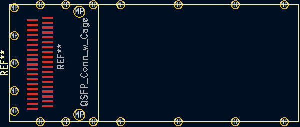

# KiCad_Libraries

KiCad Symbols and Footprints

These symbols and footprints have **NOT** yet been tested on working projects.

## KiCad Symbols

### QSFP SFF-8654

[QSFP](https://en.wikipedia.org/wiki/Small_Form-factor_Pluggable#QSFP)

[Specification](https://members.snia.org/document/dl/25896)

TX are inputs as the data will be sent over the Optical/Copper Interface Cable. RX are outputs as they are received from the Optical/Copper Interface Cable.

### Alveo U25 Debug Connector

Pinout was [manually traced](https://github.com/mwrnd/notes/blob/main/Alveo_U25/debug_log.md#figuring-out-the-jtag-debug-connector).

### OpenCAPI Carrier and Host

**UNTESTED**

Uses the pinout from the [ADM-PCIE-9V5 User Manual (Pg15-19of38)](https://www.alpha-data.com/xml/user_manuals/adm-pcie-9v5%20user%20manual_v1_4.pdf).

Note that a [SlimSAS 8x](https://web.archive.org/web/20210121175017/https://www.sfpcables.com/24g-internal-slimsas-sff-8654-to-sff-8654-8i-cable-straight-to-90-degree-left-angle-8x-12-sas-4-0-85-ohm-0-5-1-meter) cable flips rows. Row A becomes B and vice versa. Use the symbol that is opposite to the one you will connect to. If you intend to connect your design to a board with the Carrier (Add-In Card) symbol, use the Host symbol in your design. TX and RX are relative to the symbol. TX for Host gets flipped by cable into RX for Carrier. **Please confirm this yourself before using the symbol!**

## KiCad Footprints

### QSFP SFF-8654

[QSFP](https://en.wikipedia.org/wiki/Small_Form-factor_Pluggable#QSFP) connector with Cage

Based on [U90-A111-1001](https://www.digikey.com/en/products/detail/amphenol-cs-commercial-products/U90-A111-1001/3464977)

### ATX 6-Pin PCIe Power Board Connector

[PCI-Express 6-Pin Power](https://en.wikipedia.org/wiki/PCI_Express#Power) connector.

Based on [2-1775099-1](https://www.digikey.com/en/products/detail/te-connectivity-amp-connectors/2-1775099-1/5272791)

Use *Conn_02x03_Counter_Clockwise_MountingPin* included with KiCad as the schematic symbol.

### SlimSAS 8i Right-Angle Board Connector

[OpenCAPI](https://files.openpower.foundation/s/xSQPe6ypoakKQdq/download/25Gbps-spec-20171108.pdf)-compatible

Based on [U10A474200T](https://www.digikey.com/en/products/detail/amphenol-cs-commercial-products/U10A474200T/14632855) or [U10A474240T](https://www.digikey.com/en/products/detail/amphenol-cs-commercial-products/U10A474240T/17066204)

Note OpenCAPI uses [SlimSAS 8i 85ohm Cables](https://web.archive.org/web/20210121175017/https://www.sfpcables.com/24g-internal-slimsas-sff-8654-to-sff-8654-8i-cable-straight-to-90-degree-left-angle-8x-12-sas-4-0-85-ohm-0-5-1-meter).

### MEC8-113-02-L-D-RA1 Board Edge Connector

[MEC8 Right-Angle](https://www.samtec.com/products/mec8-ra) 26-Pin [(2x13) Connector](http://suddendocs.samtec.com/prints/mec8-1xx-d-ra-mkt.pdf).

