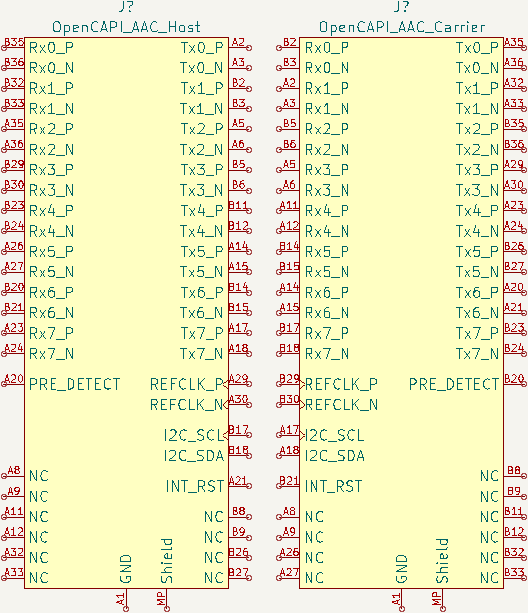

# KiCad_Libraries

KiCad Symbols and Footprints

## KiCad Symbols

### QSFP

[QSFP](https://en.wikipedia.org/wiki/Small_Form-factor_Pluggable#QSFP) connector

### OpenCAPI Carrier and Host

[OpenCAPI AAC](https://files.openpower.foundation/s/xSQPe6ypoakKQdq/download/25Gbps-spec-20171108.pdf)

## KiCad Footprints

### QSFP

[QSFP](https://en.wikipedia.org/wiki/Small_Form-factor_Pluggable#QSFP) connector with Cage

### ATX 6-Pin PCIe Power Board Connector

[PCI-Express 6-Pin Power](https://en.wikipedia.org/wiki/PCI_Express#Power) connector based on [2-1775099-1](https://www.digikey.com/en/products/detail/te-connectivity-amp-connectors/2-1775099-1/5272791).

### SlimSAS 8i Right-Angle Board Connector

[OpenCAPI](https://files.openpower.foundation/s/xSQPe6ypoakKQdq/download/25Gbps-spec-20171108.pdf)-compatible, [U10A474200T](https://www.digikey.com/en/products/detail/amphenol-cs-commercial-products/U10A474200T/14632855) and [U10A474240T](https://www.digikey.com/en/products/detail/amphenol-cs-commercial-products/U10A474240T/17066204)

